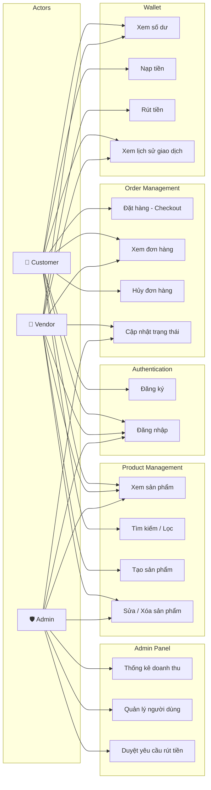
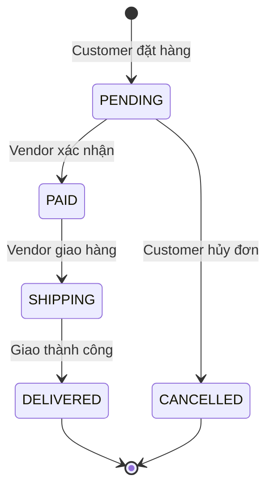
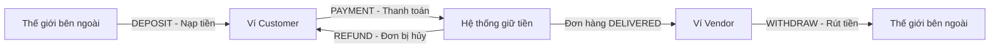

# 🔍 REQUIREMENT ANALYSIS
## TechMart E-Commerce Ecosystem
**Phiên bản:** 1.0  
**Ngày tạo:** 2026-04-27

---

## 1. PHÂN TÍCH ACTOR - USE CASE

### 1.1 Sơ đồ Use Case tổng quan

---

## 2. PHÂN TÍCH CHI TIẾT CÁC USE CASE QUAN TRỌNG

### 2.1 UC-07: Đặt hàng (Checkout) — Use Case phức tạp nhất

**Actor:** Customer (Đã đăng nhập)  
**Mô tả:** Khách hàng thanh toán danh sách sản phẩm đã chọn bằng ví nội bộ.  

**Tiền điều kiện (Preconditions):**
- Customer đã đăng nhập.
- Ví có đủ số dư cho tổng đơn hàng.
- Tất cả sản phẩm trong đơn hàng còn đủ tồn kho.

**Luồng chính (Main Flow):**
1. Customer gửi danh sách sản phẩm (productId, quantity) lên API.
2. Hệ thống tính tổng tiền dựa trên giá hiện tại của từng sản phẩm.
3. Hệ thống kiểm tra số dư ví >= tổng tiền.
4. Hệ thống kiểm tra tồn kho >= số lượng yêu cầu (cho TỪNG sản phẩm).
5. **[ATOMIC TRANSACTION BẮT ĐẦU]**
   - 5a. Trừ tiền ví Customer (Optimistic Lock trên Wallet).
   - 5b. Trừ tồn kho từng Product (Optimistic Lock trên Product).
   - 5c. Tạo bản ghi Order (status = PENDING).
   - 5d. Tạo các bản ghi OrderItem.
   - 5e. Ghi log Transaction (type = PAYMENT).
   - **[ATOMIC TRANSACTION KẾT THÚC]**
6. Trả về OrderResponse cho Customer.

**Luồng ngoại lệ (Exception Flows):**

| Bước | Điều kiện lỗi | Xử lý |
|:-----|:-------------|:------|
| Bước 3 | Số dư ví không đủ | Trả lỗi 400: "Số dư không đủ để thanh toán" |
| Bước 4 | Sản phẩm hết hàng hoặc số lượng yêu cầu vượt tồn kho | Trả lỗi 400: "Sản phẩm X chỉ còn Y sản phẩm" |
| Bước 5a | Optimistic Lock conflict (2 người thanh toán cùng lúc) | Rollback toàn bộ, trả lỗi 409: "Giao dịch bị xung đột, vui lòng thử lại" |
| Bước 5b | Optimistic Lock conflict (2 người mua cùng sản phẩm cuối) | Rollback toàn bộ, trả lỗi 409: "Sản phẩm đã được người khác mua" |

**Hậu điều kiện (Postconditions):**
- Số dư ví Customer giảm đúng bằng tổng tiền đơn hàng.
- Tồn kho từng sản phẩm giảm đúng bằng số lượng đã mua.
- Một bản ghi Order mới ở trạng thái PENDING.
- Một bản ghi Transaction (type = PAYMENT) được ghi vào hệ thống.

---

### 2.2 UC-09: Hủy đơn hàng

**Actor:** Customer  
**Tiền điều kiện:** Đơn hàng ở trạng thái PENDING.

**Luồng chính:**
1. Customer gửi yêu cầu hủy đơn hàng (orderId).
2. Hệ thống kiểm tra đơn hàng thuộc về Customer này.
3. Hệ thống kiểm tra trạng thái đơn = PENDING.
4. **[ATOMIC TRANSACTION]**
   - 4a. Cộng lại tiền vào ví Customer.
   - 4b. Cộng lại tồn kho cho từng sản phẩm.
   - 4c. Cập nhật Order.status = CANCELLED.
   - 4d. Ghi log Transaction (type = REFUND).
5. Trả về kết quả thành công.

**Luồng ngoại lệ:**
- Nếu đơn hàng không phải PENDING → Trả lỗi 400: "Chỉ có thể hủy đơn hàng đang chờ xử lý".

---

### 2.3 UC-13: Rút tiền (Vendor)

**Actor:** Vendor  
**Luồng chính:**
1. Vendor gửi yêu cầu rút tiền (amount).
2. Hệ thống kiểm tra số dư ví >= amount.
3. Tạo bản ghi yêu cầu rút tiền (trạng thái: PENDING_APPROVAL).
4. Admin nhận được thông báo yêu cầu rút tiền mới.
5. Admin duyệt → Hệ thống trừ tiền ví Vendor, ghi log Transaction (type = WITHDRAW).
6. Admin từ chối → Yêu cầu bị hủy, ví không bị ảnh hưởng.

---

## 3. PHÂN TÍCH LUỒNG TRẠNG THÁI (State Diagrams)

### 3.1 Vòng đời Đơn hàng (Order Lifecycle)

**Quy tắc chuyển trạng thái:**
| Từ trạng thái | Sang trạng thái | Ai được phép? | Hành động phụ |
|:--------------|:----------------|:-------------|:-------------|
| PENDING | PAID | Vendor, Admin | - |
| PENDING | CANCELLED | Customer | Hoàn tiền (REFUND) + Cộng tồn kho |
| PAID | SHIPPING | Vendor, Admin | - |
| SHIPPING | DELIVERED | Vendor, Admin | Cộng tiền vào ví Vendor |

### 3.2 Luồng tiền trong hệ thống (Money Flow)

---

## 4. PHÂN TÍCH QUYỀN TRUY CẬP (Authorization Matrix)

| API Endpoint | Customer | Vendor | Admin |
|:-------------|:--------:|:------:|:-----:|
| `POST /api/auth/register` | ✅ | ✅ | ✅ |
| `POST /api/auth/login` | ✅ | ✅ | ✅ |
| `GET /api/categories` | ✅ | ✅ | ✅ |
| `POST /api/categories` | ❌ | ❌ | ✅ |
| `PUT /api/categories/{id}` | ❌ | ❌ | ✅ |
| `DELETE /api/categories/{id}` | ❌ | ❌ | ✅ |
| `GET /api/products` | ✅ | ✅ | ✅ |
| `GET /api/products/{id}` | ✅ | ✅ | ✅ |
| `POST /api/products` | ❌ | ✅ | ✅ |
| `PUT /api/products/{id}` | ❌ | ✅ (chủ SP) | ✅ |
| `DELETE /api/products/{id}` | ❌ | ✅ (chủ SP) | ✅ |
| `GET /api/products/search` | ✅ | ✅ | ✅ |
| `POST /api/orders/checkout` | ✅ | ❌ | ❌ |
| `GET /api/orders/my-orders` | ✅ | ❌ | ❌ |
| `PUT /api/orders/{id}/status` | ❌ | ✅ | ✅ |
| `PUT /api/orders/{id}/cancel` | ✅ | ❌ | ❌ |
| `GET /api/wallet/balance` | ✅ | ✅ | ✅ |
| `POST /api/wallet/deposit` | ✅ | ✅ | ❌ |
| `POST /api/wallet/withdraw` | ❌ | ✅ | ❌ |
| `GET /api/wallet/transactions` | ✅ | ✅ | ✅ |
| `GET /api/admin/stats` | ❌ | ❌ | ✅ |
| `GET /api/admin/users` | ❌ | ❌ | ✅ |

---

## 5. PHÂN TÍCH RỦI RO KỸ THUẬT

| # | Rủi ro | Mức độ | Giải pháp |
|:--|:-------|:-------|:----------|
| 1 | **Overselling** — 2 người mua cùng sản phẩm cuối cùng | Cao | Optimistic Locking (`@Version` trên Product) |
| 2 | **Double Spending** — 1 người mua 2 đơn cùng lúc, ví bị trừ âm | Cao | Optimistic Locking (`@Version` trên Wallet) + Kiểm tra số dư trong `@Transactional` |
| 3 | **Dữ liệu không nhất quán** — Trừ tiền rồi nhưng chưa trừ tồn kho thì server chết | Cao | Bọc toàn bộ luồng checkout trong `@Transactional` để đảm bảo rollback |
| 4 | **N+1 Query Problem** — Lấy danh sách đơn hàng kèm sản phẩm tạo ra hàng trăm câu SQL | Trung bình | Sử dụng `@EntityGraph` hoặc `JOIN FETCH` trong JPQL |
| 5 | **Sensitive Data Exposure** — password/version bị trả ra ngoài API | Trung bình | Duy trì DTO Request/Response. Không bao giờ return Entity trực tiếp |
