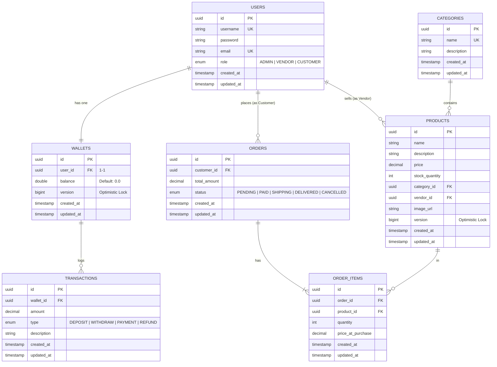

# 🗄️ DATABASE DESIGN
## TechMart E-Commerce Ecosystem
**Phiên bản:** 1.0  
**Ngày tạo:** 2026-04-27

---

## 1. SƠ ĐỒ QUAN HỆ THỰC THỂ (Entity Relationship Diagram)

---

## 2. CHI TIẾT CÁC BẢNG

### 2.1 Bảng `users`
| Cột | Kiểu dữ liệu | Ràng buộc | Mô tả |
|:----|:-------------|:----------|:------|
| id | UUID | PK, NOT NULL, Auto-gen | Khóa chính |
| username | VARCHAR | UNIQUE, NOT NULL | Tên đăng nhập |
| password | VARCHAR | NOT NULL | Mật khẩu (đã mã hóa BCrypt) |
| email | VARCHAR | UNIQUE, NOT NULL | Email liên hệ |
| role | VARCHAR(20) | ENUM | Vai trò: ADMIN, VENDOR, CUSTOMER |
| created_at | TIMESTAMP | Auto-gen | Ngày tạo tài khoản |
| updated_at | TIMESTAMP | Auto-update | Ngày cập nhật gần nhất |

### 2.2 Bảng `wallets`
| Cột | Kiểu dữ liệu | Ràng buộc | Mô tả |
|:----|:-------------|:----------|:------|
| id | UUID | PK | Khóa chính |
| user_id | UUID | FK → users.id, UNIQUE | Mỗi user chỉ có 1 ví |
| balance | DOUBLE | Default 0.0 | Số dư ví hiện tại |
| version | BIGINT | @Version | Dùng cho Optimistic Locking, chống ghi đè song song |
| created_at | TIMESTAMP | Auto-gen | - |
| updated_at | TIMESTAMP | Auto-update | - |

### 2.3 Bảng `categories`
| Cột | Kiểu dữ liệu | Ràng buộc | Mô tả |
|:----|:-------------|:----------|:------|
| id | UUID | PK | Khóa chính |
| name | VARCHAR(100) | NOT NULL, UNIQUE | Tên danh mục |
| description | TEXT | - | Mô tả danh mục |
| created_at | TIMESTAMP | Auto-gen | - |
| updated_at | TIMESTAMP | Auto-update | - |

### 2.4 Bảng `products`
| Cột | Kiểu dữ liệu | Ràng buộc | Mô tả |
|:----|:-------------|:----------|:------|
| id | UUID | PK | Khóa chính |
| name | VARCHAR | NOT NULL | Tên sản phẩm |
| description | TEXT | - | Mô tả sản phẩm |
| price | DECIMAL | NOT NULL | Giá bán |
| stock_quantity | INT | - | Số lượng tồn kho |
| category_id | UUID | FK → categories.id | Thuộc danh mục nào |
| vendor_id | UUID | FK → users.id | Người bán nào đăng sản phẩm |
| image_url | VARCHAR | - | Đường dẫn ảnh sản phẩm |
| version | BIGINT | @Version | Optimistic Locking (chống overselling) |
| created_at | TIMESTAMP | Auto-gen | - |
| updated_at | TIMESTAMP | Auto-update | - |

### 2.5 Bảng `orders`
| Cột | Kiểu dữ liệu | Ràng buộc | Mô tả |
|:----|:-------------|:----------|:------|
| id | UUID | PK | Khóa chính |
| customer_id | UUID | FK → users.id | Ai đặt đơn |
| total_amount | DECIMAL | - | Tổng tiền đơn hàng |
| status | VARCHAR(20) | ENUM | Trạng thái đơn hàng |
| created_at | TIMESTAMP | Auto-gen | Ngày đặt hàng |
| updated_at | TIMESTAMP | Auto-update | - |

### 2.6 Bảng `order_items`
| Cột | Kiểu dữ liệu | Ràng buộc | Mô tả |
|:----|:-------------|:----------|:------|
| id | UUID | PK | Khóa chính |
| order_id | UUID | FK → orders.id | Thuộc đơn hàng nào |
| product_id | UUID | FK → products.id | Sản phẩm nào |
| quantity | INT | - | Số lượng mua |
| price_at_purchase | DECIMAL | - | Giá tại thời điểm mua (snapshot giá, không lấy giá hiện tại) |
| created_at | TIMESTAMP | Auto-gen | - |
| updated_at | TIMESTAMP | Auto-update | - |

### 2.7 Bảng `transactions`
| Cột | Kiểu dữ liệu | Ràng buộc | Mô tả |
|:----|:-------------|:----------|:------|
| id | UUID | PK | Khóa chính |
| wallet_id | UUID | FK → wallets.id | Ví nào phát sinh giao dịch |
| amount | DECIMAL | - | Số tiền giao dịch |
| type | VARCHAR | ENUM | Loại: DEPOSIT, WITHDRAW, PAYMENT, REFUND |
| description | VARCHAR | - | Mô tả giao dịch (VD: "Thanh toán đơn hàng #123") |
| created_at | TIMESTAMP | Auto-gen | Thời điểm giao dịch |
| updated_at | TIMESTAMP | Auto-update | - |

---

## 3. GHI CHÚ THIẾT KẾ QUAN TRỌNG

### 3.1 Tại sao `price_at_purchase` trong `order_items`?
Giá sản phẩm có thể thay đổi bất kỳ lúc nào (Vendor giảm giá, tăng giá). Nếu lưu `product_id` rồi JOIN sang bảng `products` để lấy giá, thì khi Vendor đổi giá, tất cả đơn hàng cũ sẽ bị hiển thị sai tổng tiền.  
→ **Giải pháp:** Lưu snapshot giá tại thời điểm mua vào cột `price_at_purchase` để bảo toàn dữ liệu lịch sử.

### 3.2 Tại sao dùng `@Version` cho Wallet và Product?
- **Wallet:** Ngăn chặn 1 user gửi 2 request thanh toán cùng lúc, dẫn đến trừ tiền 2 lần (Double Spending).
- **Product:** Ngăn chặn 2 user cùng mua sản phẩm cuối cùng trong kho (Overselling).

Cơ chế: Khi 2 request đồng thời đọc cùng version = 5, request đầu khi lưu sẽ tăng version lên 6. Request thứ 2 cũng định lưu với version = 5, phát hiện đã bị thay đổi → lập tức throw `OptimisticLockingFailureException` → Rollback.

### 3.3 Tại sao `balance` trong Wallet dùng `Double` chứ không dùng `BigDecimal`?
Đây là điểm cần **cải thiện**. Trong môi trường sản xuất (Production), `Double` có thể gây sai số khi tính toán tiền tệ (ví dụ: 0.1 + 0.2 ≠ 0.3 trong hệ nhị phân). Nên đổi sang `BigDecimal` để đảm bảo chính xác tuyệt đối. Tuy nhiên, trong giai đoạn học tập hiện tại, `Double` vẫn chấp nhận được.
