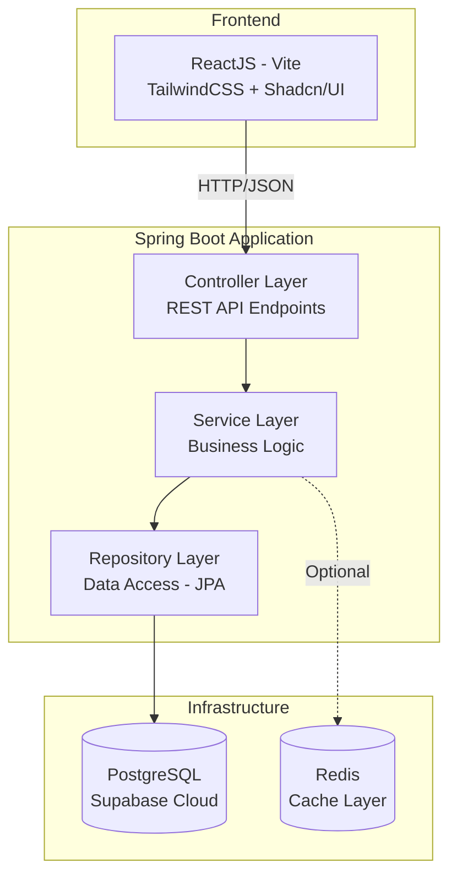
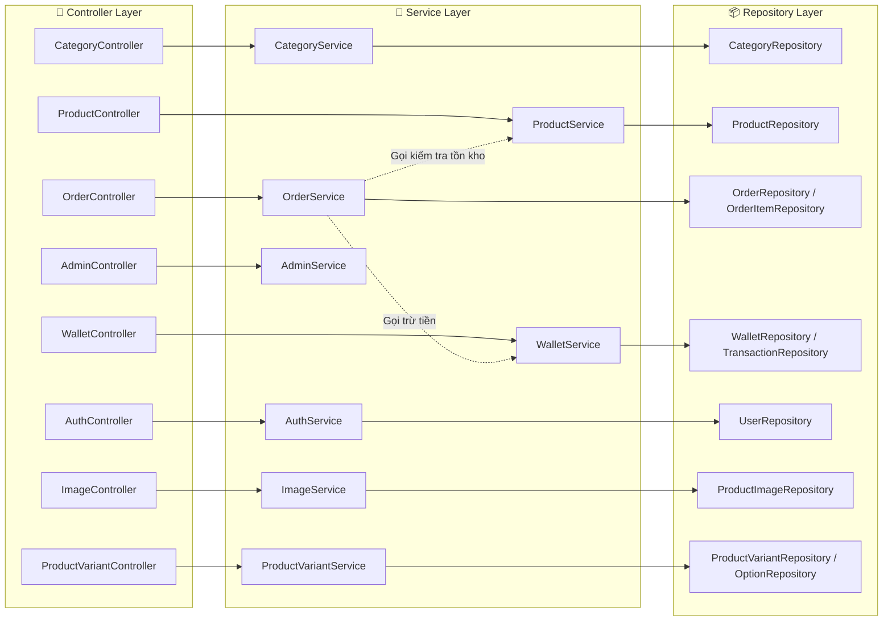
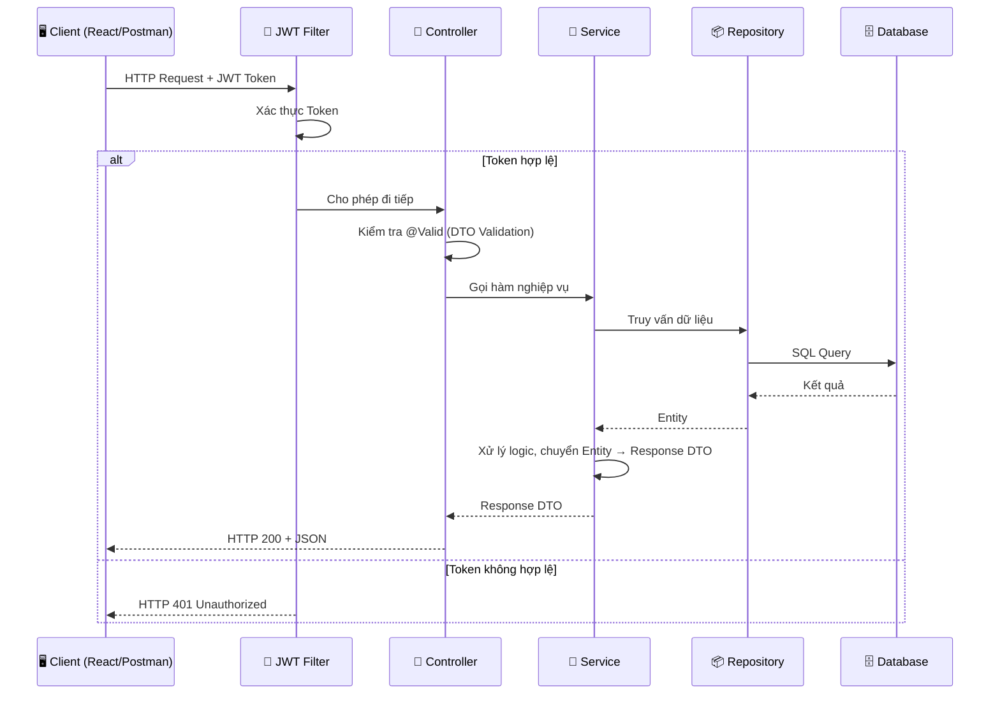

# 🏗️ ARCHITECTURE DESIGN
## TechMart E-Commerce Ecosystem
**Phiên bản:** 1.0  
**Ngày tạo:** 2026-04-27

---

## 1. KIẾN TRÚC TỔNG THỂ (System Architecture)



---

## 2. KIẾN TRÚC 3 LỚP CHI TIẾT (Layered Architecture)



---

Cap nhat Product Media & Variant:

- `ImageController`/`ImageService` quan ly upload, delete, set primary image cho ProductImage.
- `ProductVariantController`/`ProductVariantService` quan ly option groups, option values va variants.
- `OrderService` va `CartService` can doc variant de tinh gia, ton kho va snapshot selected options khi product co variants.
- `ProductService` chi nen quan ly product cha; khong nhan `imageUrl` trong `ProductRequest`.

## 3. CẤU TRÚC PACKAGE (Project Structure)

```
src/main/java/com/springboot/techmart/
│
├── TechMartBackendApplication.java          # Điểm khởi chạy ứng dụng
│
├── config/                                   # Cấu hình hệ thống
│   ├── SecurityConfig.java                   #   Cấu hình Spring Security
│   ├── JwtConfig.java                        #   Cấu hình JWT properties
│   └── CorsConfig.java                       #   Cho phép Frontend gọi API cross-origin
│
├── controller/                               # REST API Endpoints
│   ├── AuthController.java                   #   POST /auth/register, /auth/login
│   ├── CategoryController.java               #   CRUD /categories
│   ├── ProductController.java                #   CRUD /products + /products/search
│   ├── OrderController.java                  #   POST /orders/checkout, GET /orders/my-orders
│   ├── WalletController.java                 #   GET /wallet/balance, POST /wallet/deposit
│   └── AdminController.java                  #   GET /admin/stats, /admin/users
│
├── service/                                  # Giao diện Service (Interface)
│   ├── AuthService.java
│   ├── CategoryService.java
│   ├── ProductService.java
│   ├── OrderService.java
│   ├── WalletService.java
│   └── AdminService.java
│
├── service/impl/                             # Cài đặt Service (Implementation)
│   ├── AuthServiceImpl.java
│   ├── CategoryServiceImpl.java
│   ├── ProductServiceImpl.java
│   ├── OrderServiceImpl.java                 #   Chứa logic Checkout phức tạp nhất
│   ├── WalletServiceImpl.java
│   └── AdminServiceImpl.java
│
├── repository/                               # Data Access Layer (JPA)
│   ├── UserRepository.java
│   ├── CategoryRepository.java
│   ├── ProductRepository.java
│   ├── OrderRepository.java
│   ├── OrderItemRepository.java
│   ├── WalletRepository.java
│   └── TransactionRepository.java
│
├── entity/                                   # JPA Entities (Mapping Database)
│   ├── BaseEntity.java                       #   Lớp cha: id, createdAt, updatedAt
│   ├── User.java
│   ├── Wallet.java
│   ├── Category.java
│   ├── Product.java
│   ├── Order.java
│   ├── OrderItem.java
│   ├── Transaction.java
│   ├── Role.java                             #   Enum: ADMIN, VENDOR, CUSTOMER
│   ├── Status.java                           #   Enum: PENDING, PAID, SHIPPING, ...
│   └── Type.java                             #   Enum: DEPOSIT, WITHDRAW, PAYMENT, REFUND
│
├── dto/                                      # Data Transfer Objects
│   ├── request/                              #   Dữ liệu Client gửi lên
│   │   ├── CategoryRequest.java
│   │   ├── ProductRequest.java
│   │   ├── OrderRequest.java                 #   Chứa List<OrderItemRequest>
│   │   ├── LoginRequest.java
│   │   ├── RegisterRequest.java
│   │   └── WalletDepositRequest.java
│   │
│   └── response/                             #   Dữ liệu Server trả về
│       ├── CategoryResponse.java
│       ├── ProductResponse.java
│       ├── OrderResponse.java
│       ├── UserResponse.java
│       ├── WalletResponse.java
│       ├── TransactionResponse.java
│       └── AuthResponse.java                 #   Chứa JWT token
│
├── exception/                                # Xử lý ngoại lệ toàn cục
│   ├── GlobalExceptionHandler.java           #   @ControllerAdvice - Bắt mọi Exception
│   ├── ResourceNotFoundException.java        #   404 - Không tìm thấy
│   ├── BadRequestException.java              #   400 - Dữ liệu không hợp lệ
│   ├── InsufficientBalanceException.java     #   400 - Số dư không đủ
│   └── ConflictException.java                #   409 - Optimistic Lock conflict
│
└── security/                                 # Bảo mật (Triển khai cuối cùng)
    ├── JwtProvider.java                      #   Tạo và xác thực JWT Token
    ├── JwtAuthenticationFilter.java          #   Filter kiểm tra Token trong Header
    └── CustomUserDetailsService.java         #   Load User từ DB cho Spring Security
```

---

### 3.1 Package bo sung cho Product Media & Variant

Khi triển khai product media và variant, package structure cần bổ sung:

| Layer | Thành phần mới | Trách nhiệm |
|:------|:---------------|:------------|
| Controller | `ImageController` | Upload/delete/set primary product images |
| Controller | `ProductVariantController` | Quản lý option groups, option values, variants |
| Service | `ImageService`, `ImageServiceImpl` | Validate file, upload Cloudinary, lưu ProductImage |
| Service | `ProductVariantService`, `ProductVariantServiceImpl` | Validate SKU, tổ hợp option, giá/tồn kho variant |
| Repository | `ProductImageRepository` | Truy vấn ảnh theo product, primary image |
| Repository | `ProductVariantRepository` | Truy vấn variant theo product/SKU |
| Repository | `ProductOptionGroupRepository` | Truy vấn nhóm option |
| Repository | `ProductOptionValueRepository` | Truy vấn option values |
| Entity | `ProductImage` | Gallery/thumbnail cho Product |
| Entity | `ProductOptionGroup`, `ProductOptionValue` | Cấu hình option |
| Entity | `ProductVariant` | SKU bán được, có giá/tồn kho riêng |

---

## 4. LUỒNG XỬ LÝ REQUEST (Request Pipeline)



---

## 5. NGUYÊN TẮC THIẾT KẾ

### 5.1 Quy tắc phụ thuộc giữa các Layer

```
Controller → Service → Repository → Entity
     ↑                                  ↑
     |                                  |
    DTO                            Database
```

**Quy tắc sắt đá:**
1. **Controller CHỈ ĐƯỢC gọi Service.** Không bao giờ gọi thẳng Repository.
2. **Service CHỈ ĐƯỢC gọi Repository.** Không bao giờ trả Entity ra ngoài, luôn chuyển sang DTO.
3. **Repository CHỈ NÓI CHUYỆN với Database.** Không chứa business logic.
4. **Entity KHÔNG BAO GIỜ lộ ra ngoài Controller.** Mọi dữ liệu vào/ra đều qua DTO.

### 5.2 Tại sao Service dùng Interface + Impl?
- **Interface (CategoryService):** Khai báo "hợp đồng" — Service này phải có những hàm gì. Code trong Controller chỉ phụ thuộc vào Interface, không biết bên trong Implementation viết gì.
- **Impl (CategoryServiceImpl):** Cài đặt cụ thể cho hợp đồng đó.

Lợi ích: Sau này nếu cần thay đổi logic hoàn toàn (ví dụ chuyển từ thanh toán nội bộ sang Momo), bạn chỉ cần viết một `WalletServiceMomoImpl` mới mà KHÔNG CẦN SỬA Controller. Đây là nguyên tắc **Dependency Inversion** trong SOLID.
